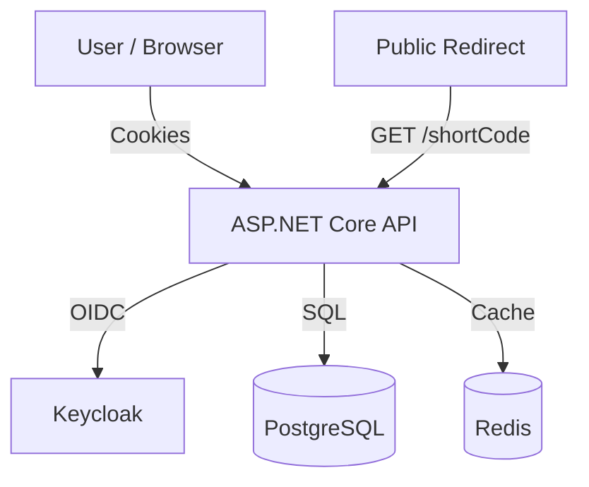

# ByteLink - URL Shortener PRD

## 1. Overview
ByteLink is a high-performance URL shortening service designed to be used by our internal React frontend. It provides a public-facing redirection service and a private management dashboard.

## 2. Goals & Objectives
- **Core Functionality:** Allow users to shorten long URLs into concise, shareable links.
- **User Management:** Secure user accounts via Keycloak.
- **Performance:** Ensure low-latency redirects (< 50ms) using Redis caching.
- **Reliability:** Persistent storage in PostgreSQL.
- **BFF Pattern:** Use the Backend-for-Frontend pattern to handle authentication securely via HttpOnly cookies.

## 3. Tech Stack
- **Backend:** ASP.NET Core (.NET 10)
- **Identity Provider:** Keycloak (OIDC)
- **Database:** PostgreSQL (via Entity Framework Core)
- **Caching:** Redis (StackExchange.Redis)
- **Frontend:** React (TypeScript) + Vite
- **API Documentation:** Scalar / OpenAPI

## 4. Functional Requirements

### 4.1 Authentication (BFF)
- **Flow:** OpenID Connect (Authorization Code Flow with PKCE).
- **Session:** Managed via Secure, HttpOnly, SameSite=Lax cookies (`BFF-Session`).
- **Endpoints:**
  - `GET /api/login`: Redirects to Keycloak.
  - `GET /api/logout`: Clears session and logs out of Keycloak.
  - `GET /api/user`: Returns the current user profile and authentication status.
- **Smart Auth:** Supports both Cookies (Web) and JWT (Mobile/API) via a custom `SmartScheme`.

### 4.2 URL Shortening (Write)
- **Endpoint:** `POST /api/urls`
- **Access Control:** Public or Authenticated. If authenticated, the URL is linked to the user's history.
- **Input:**
  ```json
  {
    "originalUrl": "https://example.com/path?utm_source=test"
  }
  ```
- **Output:**
  ```json
  {
    "id": "uuid",
    "originalUrl": "https://example.com/path",
    "shortUrl": "https://bytelink.com/AbCd1234",
    "shortCode": "AbCd1234",
    "createdAt": "iso-date",
    "favicon": "https://favicon-url"
  }
  ```
- **Logic:**
  1. Normalize URL (remove UTM params, trim, lowercase host).
  2. Generate stable short code using SHA256 of UUID v7.
  3. Fetch/Cache favicon.
  4. Save to PostgreSQL and cache in Redis for 7 days.

### 4.3 URL Redirection (Read)
- **Endpoint:** `GET /{shortCode}`
- **Access Control:** Public.
- **Logic:**
  1. Check Redis cache.
  2. If miss, check PostgreSQL and update cache.
  3. Increment `AccessCount` (async/background).
  4. Redirect (302 Found) to `originalUrl`.

### 4.4 User History
- **Endpoint:** `GET /api/urls/history`
- **Access Control:** Authenticated.
- **Features:** Pagination and sorting by creation date.

### 4.5 Rate Limiting
- **Policies:**
  - `create_policy`: 10 requests per minute.
  - `redirect_policy`: 20 requests per 10 seconds.

## 5. Non-Functional Requirements
- **Latency:** Cached redirects in < 50ms.
- **Security:** No sensitive tokens exposed to the browser; automated token refresh logic on the server.
- **Availability:** 99.9% uptime.

## 6. Data Model

### Table: `shortened_urls`
- `Id`: UUID (v7) - PK
- `OriginalUrl`: Text - Unique Index
- `ShortCode`: Varchar(10) - Unique Index
- `CreatedAt`: Timestamp (UTC)
- `AccessCount`: BigInt
- `Favicon`: Text (nullable)

### Table: `user_urls`
- `UserId`: UUID - PK
- `ShortenedUrlId`: UUID - PK, FK -> `shortened_urls`
- `CreatedAt`: Timestamp (UTC)

## 7. Architecture Diagram


